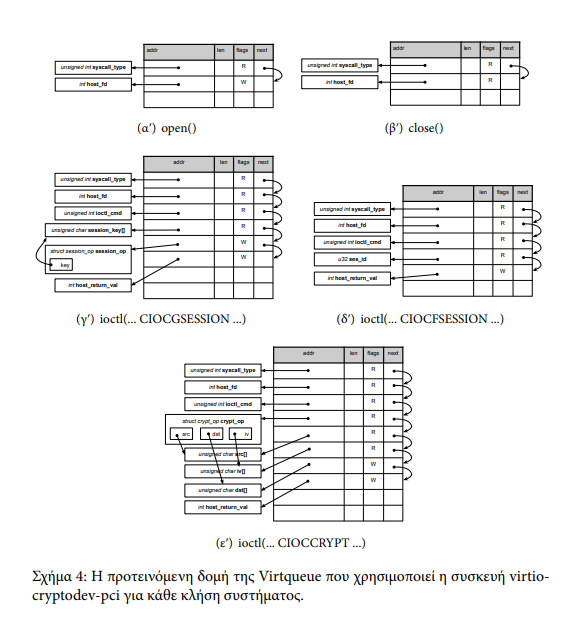

# `Εργαστήριο Λειτουργικών Συστημάτων Άσκηση 3`
Ομάδα oslab6 : 
	- Παναγιώτα-Νικολέττα Μπάρμπα el18604
	- Ανδρέας Ευαγγελάτος el18069
## `Περιεχόμενα`
1. [Sockets](#1-sockets)
	1. [Socket Handling](#11-socket-handling)
	1. [Πρωτόκολλο Επικοινωνίας](#12-πρωτόκολλο-επικοινωνίας)
	1. [O Server](#13-o-server)
	1. [O Client](#14-o-client)
1. [Κρυπτογράφηση μηνυμάτων](#2-κρυπτογράφηση-μηνυμάτων)
	1. [Η κρυπτογράφηση στους server και client](#21-η-κρυπτογράφηση-στους-server-και-client)
	1. [Επιβεβαίωση κρυπτογραφημένων μηνυμάτων](#22-επιβεβαίωση-κρυπτογραφημένων-μηνυμάτων)
1. [Frontend Driver](#3-frontend-driver)
	1. [Δομές Δεδομένων Driver](#31-δομές-δεδομένων-driver)
	1. [Κατα την εισαγωγή του module](#32-κατα-την-εισαγωγή-του-module)
	1. [Πρωτόκολλο μεταφοράς δεδομένων](#33-πρωτόκολλο-μεταφοράς-δεδομένων)
	1. [Περιγραφή συμπεριφοράς system calls στον frontend Driver](#34-περιγραφή-συμπεριφοράς-system-calls-στον-frontend-driver)
1. [Backend Driver](#4-backend-driver)
	1. [Περιγραφή λειτουργίας του backend driver](#41-περιγραφή-λειτουργίας-του-backend-driver)
1. [Μέρος του socket source code του οποίου η συμπεριφορά δεν περιγράφηκε στα προηγούμενα](#5-μέρος-του-socket-source-code-του-οποίου-η-συμπεριφορά-δεν-περιγράφηκε-στα-προηγούμενα)
	- [SSI.c](#ssic)
	- [part of packet.h and packet.c](#part-of-packeth-and-packetc)
	- [epollserver.c](#epollserverc)
	- [client.c](#clientc)
	- [encrypt.c](#encryptc)
	- [decrypt.c](#decryptc)

<div style="page-break-after: always;"></div>

# `1. Sockets`
### `1.1 Socket Handling`
Τα sockets χειρίζονται από ένα Simple Socket Interface ***SSI*** 
*(definitions από MARC J.ROCHKIND "Programming in UNIX" Simple Socket Interface αλλά **υλοποιημένο ανεξάρτητα από εμάς** [SSI.c](#ssic))*

O handle για την χρήση του interface 
```C
typedef struct{
	bool ssi_server; 	//server or client
	int ssi_fd;			//the socket fd used in calls
	int port;			//port
	char ssi_name_server[SSI_NAME_SIZE];
} SSI;
```
Οι συναρτήσεις που χρησιμοποιούνται στις υλοποιήσεις των [epollserver.c](#epollserverc) και [client.c](#clientc)
``` C
/**
 * @brief
 * Opens a socket and either listens as a server or connects to as a client.
 * @param name the address of the server (Should be NULL for server);
 * @param port the port to listen or to connect to.
 * @param server a boolean to specify the behaviour.
 * @param tcp_backlog the number of connections that can wait in queue only needed in server
 * @return a pointer to an SSI structure specifying the connection.
 */
SSI* ssi_open(char* name, uint16_t port, bool server, int tcp_backlog);

/**
 * @brief 
 * Waits for a client to connect if the ssi given belongs to a server.
 * @param ssip the SSI* to created by ssi_open
 * @return int the fd of the client -1 in case of error
 */
int ssi_server_accept(SSI* ssip);

/**
 * @brief 
 * Terminates the connection if one is up and closed the corresponding socket.
 * @param ssip a pointer to SSI structure given by open
 * @return true if connection closed successfully
 * 
 */
bool ssi_close(SSI* ssip);

/**
 * @brief Interface for handling unix sockets
 * 
 * @param socketname name of the socket
 * @param server server or client boolean
 * @param client_queue backlog
 * @return SSI* the handle for future calls
 */
SSI* ssi_un_open(char* socketname, bool server, int client_queue);
/**
 * @brief Accepting clients for unix sockets opened using the SSI.
 * 
 * @param ssip the SSI handle
 * @return int the fd of the client -1 in case of error
 */
int ssi_un_server_accept(SSI* ssip);
```
### `1.2 Πρωτόκολλο Επικοινωνίας`

Stateless προσέγγιση που απλά ανανεώνει την δυναμική <<βάση δεδομένων>> που υπάρχει στον [epollserver.c](#epollserverc). 

Ένα struct μεταφέρεται μεταξύ client και server που περιέχει κάθε δυνατή ερώτηση του client και απάντηση του server.

Αυτό το struct είναι το ακόλουθο :

```C
enum PACKET_TYPE {
	QUESTION, ANSWER
} PACKET_TYPE ;

enum COMMAND_TYPE{
	CREATE_USER, CREATE_CHANNEL, ADD_USER, SEND, READ, SERVER_SUCCESS, SERVER_FAILURE
} COMMAND_TYPE;

struct {
	uint8_t packet_type;// 1 byte
	uint8_t command;	// 1 byte
	char arg1[8];       // 8 bytes
	char arg2[8];       // 8 bytes
	char arg3[8];       // 8 bytes
	char arg4[8];       // 8 bytes
	int length;			//body length
	int id; 			//optional argument in case of read.
	char body[260];     // 260 bytes
} packet;
```
<div style="page-break-after: always;"></div>

Τα Question αφορούν ερωτήσεις από τον client προς τον server και αυτές μπορεί να είναι CREATE_USER, CREATE_CHANNEL, ADD_USER, SEND, READ οι οποίες έχουν λειτουργίες :
| Commmand	  | Description |
| ----------- | ----------- |
| CREATE_USER      | Νέος χρήστης με username, password(arg1, arg2)       |
| ADD_USER   | Προστίθεται νέος χρήστης σε ένα κανάλι (arg4, arg3) (validation required (arg1, arg2))        |
| CREATE CHANNEL | Δημιοουργείται νέο κανάλι (no validation required)  |
| SEND | Στέλνεται μήνυμα σε ένα κανάλι (arg3) (validation required (arg1, arg2)) (Msg in Body) |
| READ | Ζητείται αποστολή του id-οστού μηνύματος από το κανάλι στον client (validation required (arg1, arg2))|

<br/>

Απαντήσεις server :
| Command      | Description |
| ----------- | ----------- |
| SERVER_SUCCESS      | Επιτυχία επεξεργασίας ερωτήματος (log msg in body)       |
| SERVER_FAILURE   | Αποτυχία επεξεργασίας ερωτήματος (log msg in body)        |


<div style="page-break-after: always;"></div>

### `1.3 O Server` 
<!-- ## αποτελείται από τρία μέρη :
### - fatherServer :
Ακούει στις κλήσεις πελατών και τις αναθέτει σε διαφορετικές διεργασίες παιδιά. Είναι υπεύθυνος και για την εκκίνηση του serverAN που δρα ως βάση δεδομένων και επεξεργασία ερωτημάτων.

### - clientServer :
Παράγεται από τον fatherServer για την εξυπηρέτηση κάθε πελάτη. Επικοινωνεί με τον serverAN με unix socket μόνο όταν έχει λάβει όλο το πακέτο (μπορεί να προστεθεί alarm για χειρισμό αργών συνδέσεων (ήδη είναι over-engineered βασικά)).

### - serverAN :
Λειτουργεί ως βάση δεδοένων και αποδέχεται συνδέσεις από παιδιά τις οποίες επεξεργάζεται και επιστρέφει ανάλογο feedback.

## Διάγραμμα :

--- -->

O server χρησιμοποιεί την κλήση συστήματος epoll (παρόμοια με την poll μόνο που επιστρέφονται μόνο οι έτοιμοι περιγραφητές) για να μπορεί να διαχειριστεί πολλούς πελάτες. 
Με την 
```C 
	ev.events = EPOLLIN; //for read operations.
	ev.data.fd = server->ssi_fd; //the fd that is added
	epoll_ctl(epollfd, EPOLL_CTL_ADD, server->ssi_fd, &ev)
```
προσθέτουμε file descriptors στο σύνολο που κάνει handle η epoll και με την 
```C
	epoll_wait(epollfd, events, MAX_EVENTS, -1); //-1 timeout block indefinitely.
```
αναμένουμε κάποιο file descriptor να είναι έτοιμο για read ή το server να είναι έτοιμος να δεχθεί νέο client. <br>
Στην πρώτη περίπτωση απλά διαβάζουμε fragment του πακέτου που στέλνει ο κάθε πελάτης μέχρι να έρθει ολόκληρο (κρατάμε πόσο έχουμε διαβάσει). <br>
Στην δεύτερη απλά προσθέτουμε με την epoll_ctl τον fd του νέου πελάτη για να τον διαχειριστεί η epoll.

---

### `1.4 O Client`
Ξεκινά σύνδεση με κάποιον server η διεύθυνση του οποίου καθορίζεται από τα <i>command lines args</i> για κάθε πακέτο που πρόκειται να στείλει. Δέχεται commands από τον χρήστη και τις μεταφράζει άμεσα σε δομή <i>packet</i> την οποία αποστέλλει προς τον server, κρυπτογραφώντας την.

<div style="page-break-after: always;"></div>

# `2. Κρυπτογράφηση μηνυμάτων`
### `2.1 Η κρυπτογράφηση στους server και client`
Και στον server και στον client χρησιμοποιείται το **/dev/crypto** για την κρυπτογράφηση και αποκρυπτογράφηση των δεδομένων. 

Χρησιμοποιούνται οι κλήσεις (οι υλοποιήσεις των οποίων βρίσκονται στο [encrypt.c](#encryptc) και [decrypt.c](#decryptc)) :
``` C
/**
 * @brief encrypts data using AES Algorithm
 * 
 * @param input data to be ecrypted
 * @param output encrypted data
 * @param size size of input/output data
 */
void encryption(unsigned char* input, unsigned char* output,int size);


/**
 * @brief decrypts data using AES Algorithm
 * 
 * @param input data to be decrypted
 * @param output decrypted data
 * @param size size of input/output data
 */
void decryption(unsigned char* input, unsigned char* output,int size);


/**
 * @brief encrypts and writes data
 * 
 * @param fd the file descriptor to write the buffer to after encrypting the data
 * @param buf the buffer where the data to be send is
 * @param cnt the number of bytes to write to
 * @return ssize_t number of bytes written or a negative value in case of error
 */
ssize_t encrypt_insist_write(int fd, void* buf, size_t cnt);


/**
 * @brief reads and decrypts data
 * 
 * @param fd the file descriptor to read from 
 * @param buf the buffer to read to 
 * @param cnt the number of bytes to read
 * @return ssize_t the number of bytes read or a negative value in case of error
 */
ssize_t decrypt_insist_read(int fd, void *buf, size_t cnt);
```
---

### `2.2 Επιβεβαίωση κρυπτογραφημένων μηνυμάτων`
Με χρήση του ***tcpdump*** επιβεβαιώθηκαν πως τα μηνύματα ήταν κρυπτογραφημένα. Συγκεκριμένα χρησιμοποιώντας την εντολή
``` shell
tcpdump -i lo -vvv -XXX port <serverport>
```

<div style="page-break-after: always;"></div>

# `3. Frontend Driver`
### `3.1 Δομές Δεδομένων Driver`
- Μία λίστα με όλες τις συνδεδεμένες συσκευές (τύπου virtio cryptodev)
``` C
struct crypto_driver_data 
```
- Μία δομή για κάθε συσκευή (τύπου virtio cryptodev) που είναι συνδεδεμένη. Για πολλούς fds άρα θέλει lock.  Συγκεκριμένα, για να είμαστε σίγουροι πως δεν μπορεί να γράψει κανένας άλλος ταυτόχρονα στο ίδιο VirtQueue γιατί σε αυτή την περίπτωση ο QEMU θα λάβει trash. Χρησιμοποιούμε spinlock, αφού δεν είμαστε σε interrupt context που απαγορεύεται ο ύπνος. 
```C
	struct crypto_device {
	//next in the list
	struct list_head list;

	/* The virtio device we are associated with. */
	//this is the structure that is passed when the kernel recognizes a new virtio device that has the same
	// id as the ones we are handling and
	//passes this struct.
	struct virtio_device *vdev;
	
	//ουρά επικοινωνίας με QEMU
	struct virtqueue *vq;
	/* Lock */
	struct semaphore sem; 
	//this will be used as we wait for QEMU to process data 
	//and needs to lock so that noone else can write to vq of the same device.
	//becuase in that case QEMU will receive trash.
	//needs to be initialized when new device is attched.

	/* The minor number of the device. */
	unsigned int minor;
};
```

<div style="page-break-after: always;"></div>

- Αναπαράσταση από την πλευρά του driver ενός ανοιχτού fd
```C
	struct crypto_open_file {
	/* The crypto device this open file is associated with. */
	struct crypto_device *crdev;
	/* The fd that this device has on the Host. */
	int host_fd;
};

```

### `3.2 Κατα την εισαγωγή του module`
- Κάνουμε register τον driver να κάνει handle virtio_devices με συγκεκριμένα χαρακτηριστικά (id). Αυτό γίνεται με την κλήση :
```C
	register_virtio_driver(&virtio_crypto);
```
- Βάζουμε ποια συνάρτηση θα κληθεί όταν ο kenrel βρει νέα συσκευή που έχει ίδιο id. Εδώ αυτή η συνάρτηση είναι η 
```C 
	static int virtcons_probe(struct virtio_device *vdev);
```

<div style="page-break-after: always;"></div>

### `3.3 Πρωτόκολλο μεταφοράς δεδομένων`
Χρησιμοποιείται το προτεινόμενο πρωτόκολλο :

μόνο που στις περιπτώσεις των buffer οι pointer από structs που μεταβιβάζονται διορθώνονται στην πλευρά του QEMU.
### `3.4 Περιγραφή συμπεριφοράς system calls στον frontend Driver`

- Ανοίγει userspace process του VM κάποιο /dev/cryptodevX το οποίο διαχειρίζεται ο frontend driver.
- Ο frontend driver βρίσκει σε ποια εικονική συσκευή virtio αντιστοιχεί το /dev/cryptodevX (inode) για να βρει με ποια vq θα μιλήσει στον QEMU.
	```C
		struct crypto_device *crdev;
		...
		crdev = get_crypto_dev_by_minor(iminor(inode));
		...
		vq = crdev->vq;
	```
- Ο driver στέλνει πληροφορίες στον QEMU μέσω του virtio protocol (virtio_ring), καλεί  μέσω VirtualQueues.
	
	Π.χ. για την open η ετοιμασία της δομής προς αποστολή :
	```C
		struct scatterlist syscall_type_sg, host_fd_sg, *sgs[2];
		sg_init_one(&syscall_type_sg ,syscall_type, sizeof(*syscall_type) * 1); 
		sgs[num_out++ + num_in] = &syscall_type_sg;

		sg_init_one(&host_fd_sg ,host_fd, sizeof(*host_fd) * 1); 
		sgs[num_out + num_in++] = &host_fd_sg;
	```
- Καλεί την virtqueue_kick() (hypercall) και κάνει VM_exit (σαν trap) αφού έχει πάρει το lock για το συγκεκριμένο VirtQueue.
	```C
		if(down_interruptible(&(crdev->sem))){
			...
		}
		err = virtqueue_add_sgs(vq, sgs, num_out, num_in,
							&syscall_type_sg, GFP_ATOMIC); 	//the syscall_type_sg is given as primary key.
		virtqueue_kick(vq);			
	```
- O KVM παρεμβαίνει και μεταφέρει τα δεδομένα των virtQueues στον QEMU.
- Ο QEMU ανοίγει file descriptor στον host μηχάνημα που αφορά τον cryptodev driver που διαχειρίζεται πραγματική συσκευή και το διατηρεί ανοιχτό για τις μελλοντικές κλήσεις του frontend driver.
- Ο QEMU απαντά στον frontend driver μέσω των VirtualQueues (βάζοντας τον KVM να αποστείλει). Καλείται σε interrupt context η *vq_has_data* η οποία δεν κάνει τίποτα και απλά επιστρέφει. Ο frontend driver βρίσκεται σε ένα busy wait state όπου περιμένει σύγχρονα τα δεδομένα από το VirtQueue.
Αφού τα λάβει διαβάζει τα δεδομένα και αφήνει το lock. 
	``` C
		while (virtqueue_get_buf(vq, &len) == NULL)
		/* do nothing */;

		//now qemu has written everything it was suppossed to.	
		
		// read returned data
		...
		up(&(crdev->sem));
	```

<div style="page-break-after: always;"></div>

# `4. Backend Driver`
### `4.1 Περιγραφή λειτουργίας του backend driver`
- Αρχικά ορίζεται νέα συσκευή η ***virtio-cryptodev-pci*** στο QEMU σύμφωνα με το μοντέλο συσκευών του η οποία κληρονομεί τον τύπο *TYPE_VIRTIO_PCI*.
- Σε αυτήν ορίζεται η συνάρτηση που καλείται *vq_handle_output* όταν υπάρχει έτοιμο virtQueue και έχει κληθεί η *virtqueue_kick* από τον frontend οδηγό οπότε ο έλεγχος μεταβιβάζεται στον QEMU από τον KVM.
- Ο QEMU μπορεί πλέον να διαβάσει το virtQueue και να προσομοιώσει την συμπεριφορά που ζητείται από τον frontend οδηγό ανοίγοντας έναν file descriptor στην πραγματική συσκευή ***/dev/crypto*** στο host μηχάνημα. Ο host_fd και ο τύπος της κλήσης μεταβιβάζεται στις μελλοντικές κλήσεις από τον frontend driver.
	```C
		syscall_type = elem->out_sg[0].iov_base;
		switch (*syscall_type) {
    	case VIRTIO_CRYPTODEV_SYSCALL_TYPE_OPEN:
			...
			int fd = open("/dev/crypto", O_RDWR);
			...
			break;
		case VIRTIO_CRYPTODEV_SYSCALL_TYPE_CLOSE:
			...
			host_fd = elem->out_sg[1].iov_base;
			close(*host_fd);
			...
			break;
			
		case VIRTIO_CRYPTODEV_SYSCALL_TYPE_IOCTL:
			...
				switch (*ioctl_cmd){
				case CIOCGSESSION:
					...
					if((ret = ioctl(*host_fd, CIOCGSESSION, &sess))){
						...
					}
					...
					break;
				case CIOCFSESSION:
            		if((ret = ioctl(*host_fd, CIOCFSESSION, ses_id))){
						...
					}
					...
					break;
				case CIOCCRYPT:
					...
            		if((ret = ioctl(*host_fd, CIOCCRYPT, &cryp))){
						...
					}
					...
					break;
				}
		break;
		}
	```

<div style="page-break-after: always;"></div>

# `5. Μέρος του socket source code του οποίου η συμπεριφορά δεν περιγράφηκε στα προηγούμενα`
## `SSI.c`
```C
#include "SSI.h"
#include <stdbool.h>
#include <stdio.h>
#include <errno.h>
#include <ctype.h>
#include <string.h>
#include <stdlib.h>
#include <signal.h>
#include <unistd.h>
#include <netdb.h>
#include <sys/time.h>
#include <sys/types.h>
#include <sys/socket.h>
#include <arpa/inet.h>
#include <netinet/in.h>
#include "SafeCalls.h"
#include <sys/un.h>
#include "linkedlist.h"
SSI* ssi_open(char* name, uint16_t port, bool server, int tcp_backlog)
{
	if(server) {
		int sd;
		struct sockaddr_in sa;
		
		if ((sd = socket(PF_INET, SOCK_STREAM, 0)) < 0) {
			perror("socket");
			exit(1);
		}
		fprintf(stderr, "Created TCP socket\n");

		/* Bind to a port */
		memset(&sa, 0, sizeof(sa));
		sa.sin_family = AF_INET;
		sa.sin_port = htons(port);
		sa.sin_addr.s_addr = htonl(INADDR_ANY);
		
		if (bind(sd, (struct sockaddr *)&sa, sizeof(sa)) < 0) {
			perror("bind");
			exit(1);
		}
		fprintf(stderr, "Bound TCP socket to port %d\n", port);
		
		if (listen(sd, tcp_backlog) < 0) {
			perror("listen");
			exit(1);
		}

		SSI* ssi = sfmalloc(sizeof(SSI));
		ssi->ssi_fd = sd;
		memset(ssi->ssi_name_server, 0, sizeof(ssi->ssi_name_server));

		ssi->port = port;
		ssi->ssi_server = true;
		return ssi;
	}
	//client
	else{
		int sd;
		char *hostname = name;
		struct hostent *hp;
		struct sockaddr_in sa;

		if ((sd = socket(PF_INET, SOCK_STREAM, 0)) < 0) {
			perror("socket");
			exit(1);
		}
		fprintf(stderr, "Created TCP socket\n");

		/* Look up remote hostname on DNS */
		if ( !(hp = gethostbyname(hostname))) {
			printf("DNS lookup failed for host %s\n", hostname);
			exit(1);
		}

		/* Connect to remote TCP port */
		sa.sin_family = AF_INET;
		sa.sin_port = htons(port);
		memcpy(&sa.sin_addr.s_addr, hp->h_addr, sizeof(struct in_addr));
		fprintf(stderr, "Connecting to remote host... "); fflush(stderr);
		if (connect(sd, (struct sockaddr *) &sa, sizeof(sa)) < 0) {
			perror("connect");
			exit(1);
		}
		fprintf(stderr, "Connected.\n");
		SSI* ssi = sfmalloc(sizeof(SSI));
		ssi->port = port;
		ssi->ssi_fd = sd;
		strcpy(ssi->ssi_name_server, hostname);
		ssi->ssi_server = false;
		return ssi;
	}
}


int ssi_server_accept(SSI* ssip)
{
	if(!ssip->ssi_server){
		fprintf(stderr, "You gave me a client to accpet a server ...\n");
		return -1;
	}
	struct sockaddr_in sa;
	socklen_t len;
	int newsd;
	char addrstr[INET_ADDRSTRLEN];
	int sd = ssip->ssi_fd;

	if ((newsd = accept(sd, (struct sockaddr *)&sa, &len)) < 0) {
		perror("accept");
		return -1;
	}
	if (!inet_ntop(AF_INET, &sa.sin_addr, addrstr, sizeof(addrstr))) {
		perror("could not format IP address");
		return -1;
	}
	fprintf(stderr, "Incoming connection from %s:%d\n", addrstr, ntohs(sa.sin_port));

	return newsd;
}


bool ssi_close(SSI* ssip)
{
	//  i leave space for future edits to it.
	if(ssip->ssi_server)
	{
		close(ssip->ssi_fd);
		free(ssip);
		return true;
	}
	else
	{
		close(ssip->ssi_fd);
		free(ssip);
		return true;
	}
}


SSI* ssi_un_open(char* socketname, bool server, int client_queue)
{
	if(!server){
		struct sockaddr_un addr;
		int directorSock;
		directorSock = errorcheck(socket(AF_UNIX, SOCK_STREAM, 0), -1, "create unix socket as a child\n");
		memset(&addr, 0, sizeof(addr));
		addr.sun_family=AF_UNIX;
		strncpy(addr.sun_path, socketname, sizeof(addr.sun_path)-1);
		printf("trying to connect to %s\n", socketname);
		errorcheck(connect(directorSock, (struct sockaddr*)&addr, sizeof(addr)), -1, "failed to connect to unix socket");
		SSI* s = sfmalloc(sizeof(SSI));
		s->ssi_fd = directorSock;
		s->ssi_server = false;
		memcpy(s->ssi_name_server, socketname, strlen(socketname));
		return s;
	}else{
		struct sockaddr_un addr;
		int sock = errorcheck(socket(AF_UNIX, SOCK_STREAM, 0), -1, "error creating unix socket");
		memset(&addr, 0, sizeof(addr));
		addr.sun_family = AF_UNIX;
		memcpy(addr.sun_path, socketname, sizeof(addr.sun_path)-1);
		// errorcheck(unlink(socketname), -1, "[director] failed to unlink socket");
		errorcheck(bind(sock, (struct sockaddr*)&addr, sizeof(addr)), -1, " failed to bind to unix socket");
		errorcheck(listen(sock, client_queue), -1, "unixsock listen failed");
		SSI* s = sfmalloc(sizeof(SSI));
		s->ssi_fd = sock;
		s->ssi_server = true;
		memcpy(s->ssi_name_server, socketname, strlen(socketname));
		return s;
	}
}

int ssi_un_server_accept(SSI* ssip)
{
	if(ssip->ssi_server != true)
	{
		fprintf(stderr, "you gave me a clent to accept conn un sock\n");
		return -1;
	}
	int client = accept(ssip->ssi_fd, NULL, NULL);
	return client;
}
```
## `part of packet.h and packet.c`
```C
packet format_wrapper(PACKET_TYPE t, COMMAND_TYPE cmd, char* arg1,
char* arg2, char* arg3, char* arg4, int length, int id, 
char* body);

#define packetCU(username, password) format_wrapper(QUESTION, CREATE_USER, username, password, NULL, NULL, 0, 0, NULL)

#define packetC(username, channelname) format_wrapper(QUESTION, CREATE_CHANNEL, username, NULL, channelname, NULL, 0, 0, NULL)

#define packetA(username, password, channelname, secondusername) format_wrapper(QUESTION, ADD_USER, username, password, channelname, secondusername, 0, 0, NULL)

#define packetR(username, password, channelname, id) format_wrapper(QUESTION, READ, username, password, channelname, NULL, 0, id, NULL)

#define packetS(username, password, channelname, msg) format_wrapper(QUESTION, SEND, username, password, channelname, NULL, strlen(msg),0, msg)

#define packetServerS(msg) format_wrapper(ANSWER, SERVER_SUCCESS, NULL, NULL, NULL, NULL, strlen(msg), 0, msg)

#define packetServerF(msg) format_wrapper(ANSWER, SERVER_FAILURE, NULL, NULL, NULL, NULL, strlen(msg), 0, msg)

packet format_wrapper(PACKET_TYPE t, COMMAND_TYPE cmd, char* arg1,
char* arg2, char* arg3, char* arg4, int length, int id, 
char* body)
{
	packet p;
	memset(&p, 0, sizeof(p));
	p.packet_type = t;
	p.command = cmd;
	if(arg1 != NULL){
		memcpy(p.arg1, arg1, strlen(arg1));
	}
	if(arg2 != NULL){
		memcpy(p.arg2, arg2, strlen(arg2));
	}
	if(arg3 != NULL){
		memcpy(p.arg3, arg3, strlen(arg3));
	}
	if(arg4 != NULL){
		memcpy(p.arg4, arg4, strlen(arg4));
	}
	p.length = length;
	p.id = id;
	if(body != NULL){
		memcpy(p.body, body, length);
	}

	return p;
}

```
## `epollserver.c`
```C
#include <fcntl.h>
#include <sys/epoll.h>
#include <errno.h>
#include "SafeCalls.h"
#include <errno.h>
#include <stdio.h>
#include <ctype.h>
#include <string.h>
#include <stdlib.h>
#include <signal.h>
#include <unistd.h>
#include <netdb.h>
#include <sys/time.h>
#include <sys/types.h>
#include <sys/socket.h>
#include <arpa/inet.h>
#include <netinet/in.h>
#include <stdbool.h>
#include "socket-common.h"
#include "linkedlist.h"
#include "channel.h"
#include "user.h"
#include "message.h"
#include "anutil.h"
#include "Astring.h"
#include "SSI.h"
#include "packet.h"
#include "packet_parser.h"
#include "cryptops.h"


#define MAX_EVENTS 1024
//The private data passed around from epoll
typedef struct {
	packet input;  // the input packet
	size_t offset; // how much of the packet is read.
	int fd;		   // the file descriptor that associates the received packet and client.
} serve_data;

//used for epoll calls the file descriptors need to be non blocking
int set_non_blocking(int sockfd);

//the function that is called when new data is read from epoll.
int handle_connection(serve_data* req);

//global user list
list* userlist;
//global channel setup
list* channellist;

//initialization of global data structures
void AN_protocol_setup()
{
	userlist = emptyList;
	channellist = emptyList;
}

/*
 * Check User credentials
 */
bool validateUser(char* usrname, char* pwd)
{
	fprintf(stderr, "@validate with %s and %s\n", usrname, pwd);
	forEachList(userlist, i)
	{
		user* curruser = getData(i);
		if((strcmp(curruser->username, usrname) == 0) && (strcmp(curruser->password, pwd) == 0))
		{
			return true;
		}
	}
	return false;
}
/*
 * Check if a channel exists and is valid
 */
channel* checkChannelExistance(char *name)
{
	channel* req = NULL;
	forEachList(channellist, i)
	{
		channel* ch = getData(i);
		if(strcmp(ch->name, name) == 0)
			req = ch;
	}
	return req;
}

/*
 * Check if user has access to a specific channel
 */
bool checkAccessToChannel(channel* req, char* usrname)
{
	bool flag = false;
	forEachList(req->userlist, i)
	{
		user* u = getData(i);
		if(strcmp(u->username, usrname) == 0)
			flag = true;
	}
	return flag;
}
/*
 *	Check if a certain user exists
 */
bool checkUserExistance(char* usrname)
{	
	user* u;
	forEachList(userlist, i)
	{
		u = getData(i);
		if(strcmp(usrname, u->username)==0)
			return true;
	}
	return false;
}

/*
 * The backend login of the server
 */
packet AN_protocol_execute(packet* p)
{
	char buf[BUFSIZ];
	memset(buf, 0, sizeof(buf));
	if(p->command == CREATE_USER)
	{
		//add user to user list
		if(checkUserExistance(p->arg1)){
			return packetServerS("User already exists");
		}
		userlist = cons(user_constructor(p->arg1, p->arg2), userlist);
		printf("Created user with username : %s, password : %s\n", ((user*)head(userlist))->username, ((user*)head(userlist))->password);
		printf("list length %d\n", listlength(userlist));
		return packetServerS("User created sucessfully.");
	}
	else if(p->command == CREATE_CHANNEL)
	{
		forEachList(channellist, ch)
		{
			if(strcmp(p->arg3,((channel*)getData(ch))->name) == 0)
			{
				printf("channel already exists\n");
				return packetServerF("Channel already exists.");
			}
		}

		channellist = cons(channel_costructor(p->arg3, cons(user_constructor(p->arg1, "") ,emptyList), emptyList), channellist);
		printf("Created channel with channelname : %s username : %s, password %s\n", ((channel*)head(channellist))->name, ((user*)head(((channel*)head(channellist))->userlist))->username, ((user*)head(((channel*)head(channellist))->userlist))->password);
		printf("Channellist length %d\n", listlength(channellist));
		sprintf(buf, "Created channel %s", p->arg3);
		return packetServerS(buf);
		
	}
	else if(p->command == ADD_USER)
	{
		//user 
		//add channel user 
		//validate user. 
		if(!validateUser(p->arg1, p->arg2))
		{
			printf("failed to validate user\n");
			return packetServerS("Failed to validate user");
		}
		//check that the channel exists.
		
		channel* req = checkChannelExistance(p->arg3);
		if(req == NULL){			
			printf("channel not found requested = %s\n", p->arg3);
			return packetServerF("Channel requested not found");
		}
		if(!checkUserExistance(p->arg4))
		{
			
			printf("no such user exists %s\n", p->arg4);
			return packetServerF("No such user exists");
		}

		//check that he has access to the channel.
		bool flag = checkAccessToChannel(req, p->arg1);
		if(!flag){
			printf("user %s does not have access to %s\n", p->arg1, req->name);
			return packetServerF("Access denied for that channel");
		}
		//add user to the channel.
		req->userlist = cons(user_constructor(p->arg4, ""), req->userlist);
		printf("added user %s to %s\n", p->arg4, req->name);
		sprintf(buf, "added user %s to %s\n", p->arg4, req->name);
		return packetServerS(buf);
	}
	else if(p->command == SEND)
	{
		//as a server we receive the message here.
		//validateUser
		if(!validateUser(p->arg1, p->arg2))
		{
			printf("failed to validate user\n");
			return packetServerS("Failed to validate user");
		}
		//checkChannelExistance
		channel* req = checkChannelExistance(p->arg3);
		if(req == NULL)
		{			
			printf("channel not found requested = %s\n", p->arg3);
			return packetServerF("Channel requested not found");

		}
		//check user access to the channel.
		if(!checkAccessToChannel(req, p->arg1))
		{			
			printf("user %s does not have access to %s\n", p->arg1, req->name);
			return packetServerF("Access denied for that channel");
		}
		// memcpy(buf, p->body, p->length);
		snprintf(buf,5+strlen(p->arg1)+p->length ,"[%s]\t %s", p->arg1, p->body);
		int previousId = (req->messagelist == emptyList) ? -1 : (((message*)head(req->messagelist))->id);
		req->messagelist = cons( message_constructor(++previousId, buf , user_constructor(p->arg1, "")) , req->messagelist);
		printf("msg = %s to %s\n", (((message*)(head(req->messagelist)))->text), req->name);
		return packetServerS("Sent packet successfully");

	}
	else if(p->command == READ)
	{

		//validateUser
		if(!validateUser(p->arg1, p->arg2))
		{
			printf("failed to validate user\n");
			return packetServerS("Failed to validate user");
		}
		//checkChannelExistance
		channel* req = checkChannelExistance(p->arg3);
		if(req == NULL)
		{			
			printf("channel not found requested = %s\n", p->arg3);
			return packetServerF("Channel requested not found");

		}
		//check user access to the channel.
		if(!checkAccessToChannel(req, p->arg1))
		{			
			printf("user %s does not have access to %s\n", p->arg1, req->name);
			return packetServerF("Access denied for that channel");
		}
		int maxid = ((message*)head(req->messagelist))->id;
		int id = p->id;
		forEachList(req->messagelist, i)
		{
			message* msg = getData(i);
			if(msg->id == id)
			{
				packet temp =  packetServerS(msg->text);
				temp.id = maxid;
				return temp;
			}
		}
		return packetServerF("No such packet");
	}
	else
	{
		printf("failed command\n");
		return packetServerF("Failed Question");
	}

}


int main()
{
	struct epoll_event ev, events[MAX_EVENTS];
	int epollfd, nfds, client_sock;
	serve_data *newdata;
	SSI* server = ssi_open(NULL, TCP_PORT, true, TCP_BACKLOG);
	//epoll file descriptor.
	errorcheck(epollfd = epoll_create1(0), -1, "failed @ epoll_create1()"); // you can add cloexec to close on execve
	
	//Add the server listening socket to epoll
	ev.events = EPOLLIN; //read operations.
	ev.data.fd = server->ssi_fd;
	errorcheck(epoll_ctl(epollfd, EPOLL_CTL_ADD, server->ssi_fd, &ev), -1, "failed to add server socket to epoll");
	AN_protocol_setup();

	while(1)
	{
		nfds = epoll_wait(epollfd, events, MAX_EVENTS, -1); //-1 timeout block indefinitely.
		errorcheck(nfds, -1, "failed @epoll_wait inside event loop");

		//cycle through ready fds.
		for(int i = 0; i < nfds; i++)
		{
			if(events[i].data.fd == server->ssi_fd)
			{
				//handle new connection.
				client_sock = ssi_server_accept(server);
				if(set_non_blocking(client_sock) < 0){
					fprintf(stderr, "failed to set_non_block\n");
					close(client_sock);
					continue;
				};
				ev.events = EPOLLIN | EPOLLET; //set the client for read and make it edge triggered.
				//this means that non consumed data will not trigger epoll_wait to return.
				
				//allocate the new data for each fd.
				newdata = sfmalloc(sizeof(serve_data));
				memset(newdata, 0, sizeof(serve_data));
				newdata->fd = client_sock;
				newdata->offset = 0;   //it is already zero it is here for sanity check.

				ev.data.ptr = newdata;
				//Put client in the set of clients we are handling.
				if(epoll_ctl(epollfd, EPOLL_CTL_ADD, client_sock, &ev) < 0){
					fprintf(stderr, "failed to add a client to epoll struct\n");
					close(client_sock);
					continue;
				}
			}
			else{
				if(handle_connection(events[i].data.ptr) == -1){
					//remove him from the epoll list.
					int closingfd = ((serve_data *)events[i].data.ptr)->fd;
					serve_data* data = events[i].data.ptr;
					errorcheck(epoll_ctl(epollfd, EPOLL_CTL_DEL, closingfd, &ev), -1,
					 "failed to remove finished @ connection for epoll");
					close(closingfd);
					free(data);
					fprintf(stderr, "closed one!!\n");

					
				};
			}
		}


	}
	return 0;
}


int set_non_blocking(int sockfd)
{
	int flags, s;
	//get previous state
	flags = fcntl(sockfd, F_GETFL, 0);
	errorcheck(flags, -1, "fnctl getfl failed");
	//set new state with nonblock on
	flags |= O_NONBLOCK;
	s = fcntl(sockfd, F_SETFL, flags);
	errorcheck(s, -1, "fnctl setfl failed");
	return 0;
}


int handle_connection(serve_data* req)
{
	int fd = req->fd;
	packet response;
	int nread = read(fd, ((unsigned char* )&(req->input)) + req->offset, sizeof(req->input) - req->offset);
	//non_blocking and if it would block a flag is returned.
	if(nread == -1 && errno == EWOULDBLOCK){
		return 1;
	}if(nread == 0){
		return -1;
	}
	//renew what percentage of a full packet we have read.
	req->offset += nread;
	if(req->offset == sizeof(req->input))
	{
		fprintf(stderr, "full packet of size %ld", req->offset);
		//decrypt before executing.
		packet result;
		decryption(&req->input ,&result, sizeof(result));
		response = AN_protocol_execute(&result);
		//encrypt before sending response
		encryption(&response, &result, sizeof(result));
		memcpy(&response, &result, sizeof(result));
		insist_write(fd, &response, sizeof(response));
		return -1;
	}

	// write(fd, buf, nread);
	return 1;
}
```

## `client.c`
```C
#include <stdio.h>
#include <errno.h>
#include <ctype.h>
#include <string.h>
#include <stdlib.h>
#include <signal.h>
#include <unistd.h>
#include <netdb.h>
#include <sys/time.h>
#include <sys/types.h>
#include <sys/socket.h>
#include <fcntl.h>
#include <arpa/inet.h>
#include <netinet/in.h>
#include <stdbool.h>
#include "socket-common.h"
#include <sys/wait.h>
#include <sys/un.h>
#include "linkedlist.h"
#include "anutil.h"
#include "Astring.h"
#include "packet.h"
#include "packet_parser.h"
#include "SSI.h"
#include "cryptops.h"

#define Black "\033[0;30m"
#define Red "\033[0;31m"
#define Green "\033[0;32m"
#define Yellow "\033[0;33m"
#define Blue "\033[0;34m"
#define Purple "\033[0;35m"
#define Cyan "\033[0;36m"
#define White "\033[0;37m"
#define RESET_COLOR "\e[m"

char input[BUFSIZ];
char username[BUFSIZ];
char password[BUFSIZ];
int port;
char servername[256];
SSI* s;
//commands will be 
void handle_create();
void handle_login();
int read_response();
void handle_help();
void handle_send();
void handle_follow();
void handle_add();

ssize_t encrypt_insist_write_wrapper(const void *buf, size_t cnt)
{
	s = ssi_open(servername, port, false, 0);
	int fd = s->ssi_fd;
	return encrypt_insist_write(fd, buf, cnt);
}

int main(int argc, char** argv)
{
	
	if(argc != 3){
		printf("Usage ./client <address> <port>\n");
		exit(1);
	}
	port = atoi(argv[2]);
	memset(servername, 0, sizeof(servername));
	memcpy(servername, argv[1], strlen(argv[1]));

	memset(input, 0, sizeof(input));
	handle_login();
	while(1)
	{
		printf("> ");
		scanf("%s", input);
		if(!strcmp(input, "exit")){
			goto exit;
		}
		else if(!strcmp(input, "create")){
			handle_create();
		}
		else if(!strcmp(input, "send")){
			handle_send();
		}
		else if(!strcmp(input, "follow")){
			handle_follow();
		}
		else if(!strcmp(input, "help")){
			handle_help();
		}
		else if(!strcmp(input, "add")){
			handle_add();
		}
		else{
			printf(Red"-"RESET_COLOR" Uknown command (try help)\n");
		}
		memset(input, 0, sizeof(input));

	}

exit:
	return 0;
}

/*
 * Reads the response from the server
 */
int read_response()
{
	packet p, q;
	insist_read(s->ssi_fd, &q, sizeof(packet));
	decryption(&q, &p, sizeof(packet));
	
	ssi_close(s);
	//here we need to decrypt it.
	if(p.command == SERVER_SUCCESS){
		printf(Green"- "RESET_COLOR"%s\n", p.body);
		return p.id;
	}
	else if(p.command == SERVER_FAILURE){
		printf(Red"- "RESET_COLOR"%s\n", p.body);
	}
	return 0;
}

/*
 * Gets user credentials and log user in or creates new user
 * if credentials do not belong to an existing user
 */
void handle_login()
{
	memset(username, 0, sizeof(username));
	memset(password, 0, sizeof(password));
	printf("Enter a username [only 8 chars will be accepted] : ");
	scanf("%s", username);
	printf("Enter a password : [only 8 chars will be accepted] : ");
	scanf("%s", password);
	packet p = packetCU(username, password);
	int read = encrypt_insist_write_wrapper(&p, sizeof(p));
	read_response();
}

/*
 * Creates a new channel
 */
void handle_create()
{
	memset(input, 0, sizeof(input));
	printf("channel name to be created : ");
	scanf("%s", input);
	packet p = packetC(username, input);
	int read = encrypt_insist_write_wrapper(&p, sizeof(p));
	read_response();

}

/*
 * Prints help message
 */
void handle_help(){
	printf("Available Commands Are :\n"Blue"create\t"RESET_COLOR"to create newchannel\n");
	printf(Blue"follow\t"RESET_COLOR"read contents of a channel\n");
	printf(Blue"send\t"RESET_COLOR"send msg to a channel\n");
	printf(Blue"add\t"RESET_COLOR"add user to a channel\n");
	printf(Blue"exit\t"RESET_COLOR"terminate connection\n");
	
}
/*
 * Sends a message to a specific channel
 */
void handle_send()
{
	memset(input, 0, sizeof(input));
	char channelname[BUFSIZ];
	printf("channel : ");
	scanf("%s", channelname);
	printf("Enter message >");
	scanf("\n");
	memset(input, 0, sizeof(input));
	int nread = 0, n;
	fgets(input, PACKET_MAX_BODY_LENGTH, stdin);
	char* cp = strchr(input, '\n');
	*cp = 0;
	packet p;
	p = packetS(username, password, channelname, input);
	int read = encrypt_insist_write_wrapper(&p, sizeof(p));
	read_response();
	memset(input, 0, sizeof(input));
}

/*
 * Reads all messages from a channel
 */
void handle_follow()
{
	memset(input, 0, sizeof(input));
	char channelname[BUFSIZ];
	printf("channel : ");
	scanf("%s", channelname);
	//now get all msges from that channel.
	int id = 0;
	packet p = packetR(username, password, channelname, id);
	int maxid = id+1;

	while(id <= maxid)
	{
		int read = encrypt_insist_write_wrapper(&p, sizeof(p));
		maxid = read_response();
		p.id++;id++;
	}
}

/*
 * Adds a user (not the logged in one) to an existing channel
 * gives permission to him for that channel
 */
void handle_add()
{
	memset(input, 0, sizeof(input));
	char channelname[BUFSIZ];
	printf("channel : ");
	scanf("%s", channelname);
	char extrauser[BUFSIZ];
	memset(extrauser, 0, sizeof(extrauser));
	printf("user : ");
	scanf("%s", extrauser);

	packet p = packetA(username, password, channelname, extrauser);
	int read = encrypt_insist_write_wrapper(&p, sizeof(p));
	read_response();

}
```
## `encrypt.c`
```C
#include "socket-common.h"
#include "crypto/cryptodev.h"
#include <sys/ioctl.h>
#include <stdio.h>
#include <unistd.h>
#include <fcntl.h>
#include <string.h>
#include "linkedlist.h"
#include "cryptops.h"
#include "SafeCalls.h"
#include "anutil.h"

/**
 * @brief encrypts data
 * 
 * @param input data to be ecrypted
 * @param output encrypted data
 * @param size size of input/output data
 */
void encryption(unsigned char* input, unsigned char* output,int size){
	
	int fd = open(CRYPTODEV_NODE, O_RDWR);
    errorcheck(fd,-1,"open(/dev/crypto) {encrypt}");

    unsigned char key[] = KEY;
    unsigned char iv[] = IV;

    struct session_op sess;
    struct crypt_op cryp;

    memset(&sess, 0, sizeof(sess));
	memset(&cryp, 0, sizeof(cryp));

    /*
	 * Get crypto session for AES128
	 */
	sess.cipher = CRYPTO_AES_CBC;
	sess.keylen = KEY_SIZE;
	sess.key = key;

	errorcheck(!ioctl(fd, CIOCGSESSION, &sess),0, "ioctl(CIOCGSESSION) {encrypt}" );

    /*
	 * Encrypt input to output
	 */
	cryp.ses = sess.ses;
	cryp.len = size;
	cryp.src = input;
	cryp.dst = output;
	cryp.iv = iv;
	cryp.op = COP_ENCRYPT;

	errorcheck(!ioctl(fd, CIOCCRYPT, &cryp),0, "ioctl(CIOCCRYPT) {encrypt}" );

    /*Finish crypto session*/
    errorcheck(!ioctl(fd, CIOCFSESSION, &sess.ses),0,"ioctl(CIOCFSESSION) {encrypt}");

    errorcheck(close(fd),-1,"close(/dev/crypto) {encrypt}");

}


ssize_t encrypt_insist_write(int fd, void* buf, size_t cnt){
	unsigned char* bufout = sfmalloc(cnt);
	memset(bufout, 0, cnt);
	encryption(buf,bufout,cnt);
	return insist_write(fd,bufout,cnt);
}

```

## `decrypt.c`
```C
#include "socket-common.h"
#include "crypto/cryptodev.h"
#include <sys/ioctl.h>
#include <stdio.h>
#include <unistd.h>
#include <fcntl.h>
#include <string.h>
#include "linkedlist.h"
#include "cryptops.h"
#include "SafeCalls.h"
#include "anutil.h"

/**
 * @brief encrypts data
 * 
 * @param input data to be ecrypted
 * @param output encrypted data
 * @param size size of input/output data
 */
void encryption(unsigned char* input, unsigned char* output,int size){
	
	int fd = open(CRYPTODEV_NODE, O_RDWR);
    errorcheck(fd,-1,"open(/dev/crypto) {encrypt}");

    unsigned char key[] = KEY;
    unsigned char iv[] = IV;

    struct session_op sess;
    struct crypt_op cryp;

    memset(&sess, 0, sizeof(sess));
	memset(&cryp, 0, sizeof(cryp));

    /*
	 * Get crypto session for AES128
	 */
	sess.cipher = CRYPTO_AES_CBC;
	sess.keylen = KEY_SIZE;
	sess.key = key;

	errorcheck(!ioctl(fd, CIOCGSESSION, &sess),0, "ioctl(CIOCGSESSION) {encrypt}" );

    /*
	 * Encrypt input to output
	 */
	cryp.ses = sess.ses;
	cryp.len = size;
	cryp.src = input;
	cryp.dst = output;
	cryp.iv = iv;
	cryp.op = COP_ENCRYPT;

	errorcheck(!ioctl(fd, CIOCCRYPT, &cryp),0, "ioctl(CIOCCRYPT) {encrypt}" );

    /*Finish crypto session*/
    errorcheck(!ioctl(fd, CIOCFSESSION, &sess.ses),0,"ioctl(CIOCFSESSION) {encrypt}");

    errorcheck(close(fd),-1,"close(/dev/crypto) {encrypt}");

}


ssize_t encrypt_insist_write(int fd, void* buf, size_t cnt){
	unsigned char* bufout = sfmalloc(cnt);
	memset(bufout, 0, cnt);
	encryption(buf,bufout,cnt);
	return insist_write(fd,bufout,cnt);
}

```