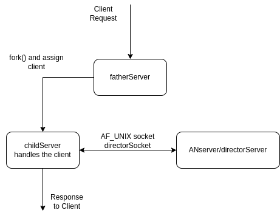

<<<<<<< HEAD
# AN Protocol

<!-- /*
 * Arguments are commands
 * REQUESTS TO SERVER
 * <username> C <channelname> | 
 * <username> A <password> <channel> <user> |
 * <username> CU <password> |
 * <username> S <password> <channel> =<...msg> |
 * <username> R <password> <channel>  <msgnumber> |
 * 
 * 
 * RESPONSES FROM SERVER
 * REQUEST DONE |
 * REQUEST FAILED |
 * MSG <channel name> <number>
 * <...> |
 * NO MORE MESSAGES
 */ -->

## AN Server Commands 
ALL packets described below must be terminated with '\n'
cmd-type | cmd-format | functionality | Server Response |
---------| -----------------| -----------|--------------|
CU       | \<username\> CU \<password\> \| | Creates new User |<b>On Success :</b> REQUEST DONE \| <b>On fail :</b> REQUEST FAILED \| |
C        | \<username\> C \<channelname\>  \| | Creates new channel with user access | <b>On Success :</b> REQUEST DONE \| <b>On fail :</b> REQUEST FAILED \| |
A        | \<username\> CU \<password\> \<channel\> \<user\> \| |Adds User to channel (original user needs access to the channel) | <b>On Success :</b> REQUEST DONE \| <b>On fail :</b> REQUEST FAILED \| |
S        | \<username\> S \<password\> \<channel\> =\<msg\> \| | Sends message to the channel. User must have access to the channel. The sender of the message is marked as User. | <b>On Success :</b> REQUEST DONE \| <b>On fail :</b> REQUEST FAILED \| |
R        | \<username\> R \<password\> \<channel\> =\<id\> \| | Requests all the messages newer than the id. All messages are given a natural number as an id and the first message in a channel is specified with 0. | <b>New message :</b> MSG \<channel\> \<id\>'\n' \<msg\> \| <b>On no new messages : </b> NO MORE MESSAGES  \<channel\> \| |
=======
# AN Protocol 2.0

Redesigned protocol.

A struct is passed accross that has every possible type of commands and/or response.
The struct is described in ./inc/packet.h and is the following :

```C
enum PACKET_TYPE {
	QUESTION, ANSWER
} PACKET_TYPE ;

enum COMMAND_TYPE{
	CREATE_USER, CREATE_CHANNEL, ADD_USER, SEND, READ, SERVER_SUCCESS, SERVER_FAILURE
} COMMAND_TYPE;

struct {
	uint8_t packet_type;// 1 byte
	uint8_t command;	// 1 byte
	char arg1[8];       // 8 bytes
	char arg2[8];       // 8 bytes
	char arg3[8];       // 8 bytes
	char arg4[8];       // 8 bytes
	int length;			//body length
	int id; 			//optional argument in case of read.
	char body[256];     // 256 bytes
} packet;
```
Τα Question αφορούν ερωτήσεις από τον client προς τον server και αυτές μπορεί να είναι CREATE_USER, CREATE_CHANNEL, ADD_USER, SEND, READ οι οποίες έχουν λειτουργίες :
| Commmand	  | Description |
| ----------- | ----------- |
| CREATE_USER      | Νέος χρήστης με username, password(arg1, arg2)       |
| ADD_USER   | Προστίθεται νέος χρήστης σε ένα κανάλι (arg4, arg3) (validation required (arg1, arg2))        |
| SEND | Στέλνεται μήνυμα σε ένα κανάλι (arg3) (validation required (arg1, arg2)) (Msg in Body) |
| READ | Ζητείται αποστολή του id-οστού μηνύματος από το κανάλι στον client (validation required (arg1, arg2))|

Απαντήσεις server :
| Command      | Description |
| ----------- | ----------- |
| SERVER_SUCCESS      | Επιτυχία επεξεργασίας ερωτήματος (log msg in body)       |
| SERVER_FAILURE   | Αποτυχία επεξεργασίας ερωτήματος (log msg in body)        |


---
# Ο Server 
## αποτελείται από τρία μέρη :
### - fatherServer :
Ακούει στις κλήσεις πελατών και τις αναθέτει σε διαφορετικές διεργασίες παιδιά. Είναι υπεύθυνος και για την εκκίνηση του serverAN που δρα ως βάση δεδομένων και επεξεργασία ερωτημάτων.

### - clientServer :
Παράγεται από τον fatherServer για την εξυπηρέτηση κάθε πελάτη. Επικοινωνεί με τον serverAN με unix socket μόνο όταν έχει λάβει όλο το πακέτο (μπορεί να προστεθεί alarm για χειρισμό αργών συνδέσεων (ήδη είναι over-engineered βασικά)).

### - serverAN :
Λειτουργεί ως βάση δεδοένων και αποδέχεται συνδέσεις από παιδιά τις οποίες επεξεργάζεται και επιστρέφει ανάλογο feedback.

## Διάγραμμα :

---

---
# Ο Client
Ξεκινά σύνδεση με κάποιον server η διεύθυνση του οποίου καθορίζεται από τα <i>command lines args.</i> Δέχεται commands από τον χρήστη και τις μεταφράζει άμεσα σε δομή <i>packet</i> και την οποία αποστέλλει προς τον server.
>>>>>>> 9d03f7f487ca1a0ffdfb192bc1e848bd23f45ad9
